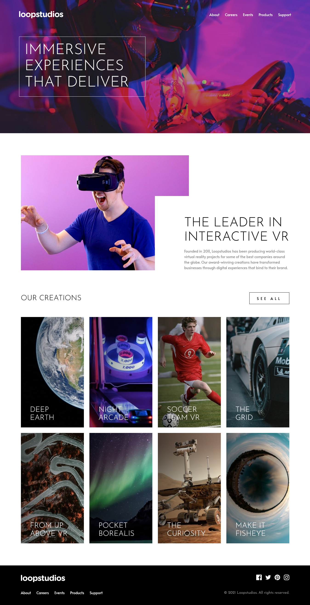

# Frontend Mentor - Loopstudios landing page solution

This is a solution to the [Loopstudios landing page challenge on Frontend Mentor](https://www.frontendmentor.io/challenges/loopstudios-landing-page-N88J5Onjw). Frontend Mentor challenges help you improve your coding skills by building realistic projects.

## Table of contents

- [Overview](#overview)
  - [Screenshot](#screenshot)
  - [Links](#links)
- [My process](#my-process)
  - [Built with](#built-with)
  - [What I learned](#what-i-learned)
- [Author](#author)

## Overview

### The challenge

Users should be able to:

- View the optimal layout for the site depending on their device's screen size
- See hover states for all interactive elements on the page

### Screenshot



### Links

- Live Site URL: [https://alfizain.github.io/loopstudios-landing-page/](https://alfizain.github.io/loopstudios-landing-page/)

## My process

### Built with

- Semantic HTML5 markup
- CSS
- Flexbox
- CSS Grid
- Mobile-first workflow
- SMACSS Methodology
- SASS - CSS preprocessor
- Javascript

### What I learned

```scss
.card {
  position: relative;
  &::before {
    position: absolute;
    top: 0;
    left: 0;
    right: 0;
    content: "";
    display: block;
    height: 100%;
    background-image: linear-gradient(to right, rgba(var.$black, 0.5), rgba(var.$black, 0));
    transition: background-color 0.3s ease-in-out;
  }
  &.card-deep-earth {
    background-image: url("../images/mobile/image-deep-earth.jpg");
  }
}
.nav-link::after {
  content: "";
  display: block;
  width: 0;
  height: 2px;
  background-color: var.$white;
  margin: auto;
  transition: 0.3s ease-in-out;
}
.nav-link:hover::after {
  width: 50%;
}
```

## Author

- Website - [Muhammad Alfi Zain](https://alfizain.github.io/AlfiZain/)
- Frontend Mentor - [@AlfiZain](https://www.frontendmentor.io/profile/AlfiZain)
